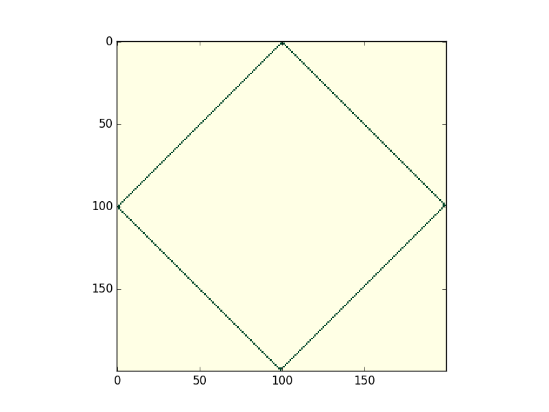

## Conway's Game of Life -- live renderer

Take a seed for Conway's Game of Life and watch it evolve live.
Written in Python using Cython



### Usage
 - Random seed:
    `python conway.py --seed random`
 - Seed from file:
    `python conway.py --seed seeds/spaceship.txt`

See `python conway.py --help` for more.

Seeds from files must consist of a rectangular grid of 0s and 1s, seperated by spaces. You can create some using the scripts `seeds/createEmptySeed.py` and `seeds/createGeometricSeed.py`.

### Building
Requires `matplotlib`, `numpy` and `cython`
```
git clone https://github.com/davekch/conway.git
cd conway
python setup.py build_ext --inplace

g++ -c -fPIC foo.cpp -o foo.o
g++ -shared -Wl,-soname,libfoo.so -o libfoo.so  foo.o
g++ -o tick tick.cpp -L/usr/local/lib/ -lcnpy -lz --std=c++11

g++ tick.o -shared -o libtick.so -no-pie -Wl,--whole-archive /usr/local/lib/libcnpy.a -Wl,--no-whole-archive

working:
g++ -c -fPIC tick.cpp -o tick.o --std=c++11
g++ -shared -Wl,-soname,libtick.so -o libtick.so tick.o -lcnpy -lz
```
