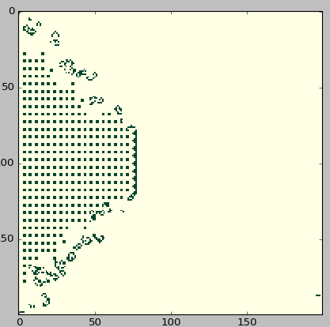

## Conway's Game of Life -- live renderer

Take a seed for Conway's Game of Life and watch it evolve live.
Written in Python using Cython



### Usage
 - Random seed:
    `python conway.py --seed random`
 - Seed from file:
    `python conway.py --seed seeds/spaceship.txt`

Seeds from files must consist of a rectangular grid of 0s and 1s, seperated by spaces.

### Building
Requires `matplotlib`, `numpy` and `cython`
```
git clone
cd conway
python setup.py build_ext --inplace
```
